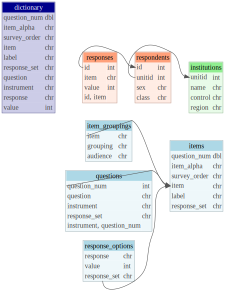

```{r setup, include=FALSE}
knitr::opts_chunk$set(echo = FALSE)
library(dplyr)
library(tidyr)
library(purrr)
library(tibble)
library(odbc)
library(DBI)
library(dm) # for ERD

con <- dbConnect(RSQLite::SQLite(), "nsse.db")
```

## Overview
This aims to provide a data model for the various survey instruments and responses at NSSE and in general. 

In addition to respondents, responses, samples, populations, etc., a given project instrument has the following components that correspond to tables in a relational database.  
 1. **Questions**, the basic prompts.  
 2. **Items**, AKA variables, the individual statements or prompts, sometimes nested under questions.  
 3. **Response options**, the set of available responses to a given item.
 
These can be represented together as a dictionary or codebook. 

## Entity Relationship Diagram
The following describes the basic relationships within a survey database. Some features would need to be added, such as `admin_year` to institutions and probably questions and items, to differentiate different administrations and year-to-year changes to the survey instrument. The repeated nature of NSSE (and other surveys) raises some interesting questions: `surveyid` (`id` here) can get recycled; minor item changes (e.g. to labels or response options) have been recorded with appending the year, e.g,. `sexorient` -> `sexorient14`; module items have been slowly renamed to follow a more readable but less predictable convention (e.g. `[instrument][question_num][item_alpha]`) but remain largely the same;

Views built upon tables are show in darker shades. Respondent and response-level data, which may include populations, are shown in salmon while institution-level tables, which may include selected comparison groups are shown in green.
 
```{r}
# can't detect keys from SQLite db, add manually
survey_dm <- dm_from_con(con) |> 
  dm_add_pk(institutions, unitid) |> 
  dm_add_pk(respondents, id) |> 
  dm_add_pk(items, item) |> 
  dm_add_pk(responses, c(id, item)) |> 
  dm_add_pk(questions, c(instrument, question_num)) |> 
  # foreign keys
  dm_add_fk(respondents, unitid, institutions) |> 
  dm_add_fk(responses, id, respondents) |> 
  dm_add_fk(questions, question_num, items) |> 
  dm_add_fk(item_groupings, item, items) |> 
  dm_add_fk(response_options, response_set, items) |> 
  # add colors; see dm_get_available_colors()
  dm_set_colors(darkblue = c(dictionary),
                lightblue = c(questions, items, response_options, item_groupings),
                lightsalmon = c(respondents, responses),
                lightgreen = c(institutions)
                ) |> 
  dm_draw(
    view_type = "all", 
    graph_name = "Survey data model",
    columnArrows = TRUE,
    column_types = TRUE
  )
DiagrammeRsvg::export_svg(survey_dm) |> 
  writeLines("survey_erd.svg")

```


## Questions
An example of the questions table. Each row consists of the question number, text of the question itself, and the instrument to which it belongs. Questions are not unique but differentiated by number and instrument; the combination of all three uniquely identify them. The *College Student Report*, [for instance](https://nsse.indiana.edu/nsse/survey-instruments/us-english.html), has the same prompt ("During the current school year, ...") for the first three items, which are internally differentiated by Engagement Indicators (factors). (The prompt is not repeated in the online version of the survey). The same prompts are also used in other sets (other instruments), like topical modules, though they may be in different order.

```{r}
tbl(con, "questions")
```

## Items
An example of the items table. Each row consists of the question number and item alpha (if applicable) concatenated as survey order, as well as the item (variable or column name), label (text as it appears on the survey), and response set of the item. `Item` uniquely identifies cases. Items are linked to questions by question_num and implicitly (good idea?) set or instrument.

```{r}
tbl(con, "items")
```

### Other item groupings
`set` indicates the instrument an question and ergo items belong to, but there are other item groupings, such as Engagement Indicators and the four overarching themes, High-impact Practices, time use, and perceived gains, among others. This mostly pertains to organization within the core survey based on a priori factor structures and design. Other item groupings might include reporting audiences (e.g., executive, advisors). 
How should this be handled? For the former issue, `set` could be more specific, e.g., "AAD" for the advising module, but "core-CL" for the core survey's Collaborative Learning items. Alternatively, `set` could be replaced with `instrument` or `module` (I think CSR uses this term to mean a set of items) and then `set` could indicate for core survey the secondary grouping and for other items inherit from instrument (or have no value at all) within the items table:
```{r}
tibble(
  instrument = c("AAD", "NSSE", "NSSE"),
  set = c("AAD", "CL", "Demographics"),
  item = c("AAD01", "CLaskhelp", "MAJfirst")
)
```

Alternatively, there could be a secondary table for known item groupings and audiences where necessary. This could be "long" by audience to allow multiple audiences, and potentially multiple groups.
```{r}
tibble(
  set = c("NSSE", "NSSE"),
  item = c("CLaskhelp", "CLaskhelp"),
  grouping = c("CL", "CL"),
  audience = c("some audience", "some other audience")
)
```

It might be a good idea to replace "core" with "NSSE" for NSSE's set value.

## Response options
An example of a table of response options. Response is the human-readable label included verbatim from the instrument, value is the numeric value assigned in the dataaset, and response set indicates which set it belongs to. Like with questions, the three combine to uniquely identify rows. Response set is a reasonably short and unique abbreviation for responses, e.g., "NSOV" is "Never Sometimes Often Very often". Response options are linked to items by response set. 

Responses should be ordered by value, not appearance on survey (e.g., if reverse-ordered), which would need to be captured elsewhere (if at all for reporting - that's more of CSR's business).
```{r}
tbl(con, "response_options")
```

Some sets are unique to one item or very long, like for country of origin or the former sexual orientation item, and so would probably just have the item name. Select-all's also may just indicate that instead of abbreviating "Not Selected" and "Selected". Ranges where only endpoints are labelled should be named as such ("low_high" or maybe "low_to_high").

```{r}
tibble(
  response = c("Not Selected", "Selected", "Poor", 2:6, "Excellent",
               "Straight (heterosexual)", "Bisexual", "...", "I prefer not to respond"),
  value = c(0, 1, 1:7, 1:4), 
  response_set = c("select_all", "select_all",
                   rep("poor_excellent", 7), 
                   rep("sexorient17", 4))
)
```

One should be careful going between software here because SPSS is much more flexible in the associations between value and response (value labels) while R's `factor` always starts at 1, so e.g. converting 0/1 FALSE/TRUE to factor will yield 1/2.

It's necessary to drop some levels for reporting activities, e.g., "9-Not Applicable" so that calculations are correct. That should just be handled during the calculation rather than by maintaining a separate variable - either convert the user-supplied missing values to missing or filter out specific values.

## Dictionary
A dictionary or codebook is simply the table containing all of these elements together. 
```{r}
tbl(con, "dictionary")
```

