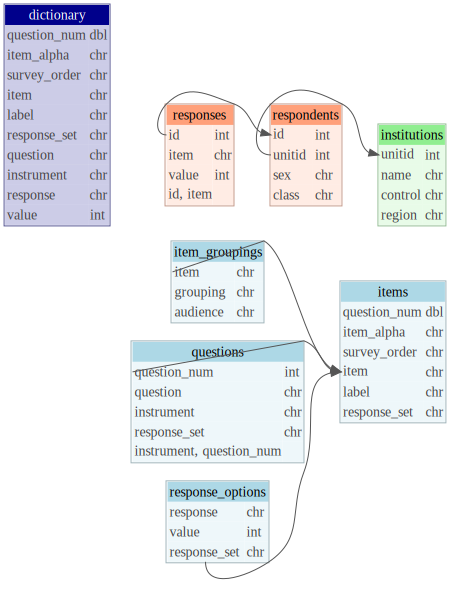

## Overview

This aims to provide a data model for the various survey instruments and
responses at NSSE and in general.

In addition to respondents, responses, samples, populations, etc., a
given project instrument has the following components that correspond to
tables in a relational database.  
1. **Questions**, the basic prompts.  
2. **Items**, AKA variables, the individual statements or prompts,
sometimes nested under questions.  
3. **Response options**, the set of available responses to a given item.

These can be represented together as a dictionary or codebook.

## Entity Relationship Diagram

The following describes the basic relationships within a survey
database. Some features would need to be added, such as `admin_year` to
institutions and probably questions and items, to differentiate
different administrations and year-to-year changes to the survey
instrument. The repeated nature of NSSE (and other surveys) raises some
interesting questions: `surveyid` (`id` here) can get recycled; minor
item changes (e.g. to labels or response options) have been recorded
with appending the year, e.g,. `sexorient` -\> `sexorient14`; module
items have been slowly renamed to follow a more readable but less
predictable convention (e.g. `[instrument][question_num][item_alpha]`)
but remain largely the same;

Views built upon tables are show in darker shades. Respondent and
response-level data, which may include populations, are shown in salmon
while institution-level tables, which may include selected comparison
groups are shown in green.

    ## ! unable to fetch autoincrement metadata for src 'src_SQLiteConnection'

    ## Keys could not be queried.

<figure>

<figcaption aria-hidden="true">Survey ERD</figcaption>
</figure>

## Questions

An example of the questions table. Each row consists of the question
number, text of the question itself, and the instrument to which it
belongs. Questions are not unique but differentiated by number and
instrument; the combination of all three uniquely identify them. The
*College Student Report*, [for
instance](https://nsse.indiana.edu/nsse/survey-instruments/us-english.html),
has the same prompt (“During the current school year, …”) for the first
three items, which are internally differentiated by Engagement
Indicators (factors). (The prompt is not repeated in the online version
of the survey). The same prompts are also used in other sets (other
instruments), like topical modules, though they may be in different
order.

    ## # Source:   table<`questions`> [3 x 4]
    ## # Database: sqlite 3.45.2 [C:\Users\bjdugan\Documents\projects\reporting\Shiny-Survey\nsse.db]
    ##   question_num question                                  instrument response_set
    ##          <int> <chr>                                     <chr>      <chr>       
    ## 1            1 During the current school year, about ho… NSSE       NSOV        
    ## 2            2 During the current school year, how much… NSSE       VSQV        
    ## 3            3 To what extent do you agree or disagree … NSSE       SDNAS

## Items

An example of the items table. Each row consists of the question number
and item alpha (if applicable) concatenated as survey order, as well as
the item (variable or column name), label (text as it appears on the
survey), and response set of the item. `Item` uniquely identifies cases.
Items are linked to questions by question_num and implicitly (good
idea?) set or instrument.

    ## # Source:   table<`items`> [?? x 6]
    ## # Database: sqlite 3.45.2 [C:\Users\bjdugan\Documents\projects\reporting\Shiny-Survey\nsse.db]
    ##    question_num item_alpha survey_order item       label            response_set
    ##           <int> <chr>      <chr>        <chr>      <chr>            <chr>       
    ##  1            1 a          1a           CLaskhelp  Asked another s… NSOV        
    ##  2            1 b          1b           CLexplain  Explained cours… NSOV        
    ##  3            1 c          1c           CLstudy    Prepared for ex… NSOV        
    ##  4            1 d          1d           CLproject  Worked with oth… NSOV        
    ##  5            2 a          2a           HOapply    Applying facts,… VSQV        
    ##  6            2 b          2b           HOanalyze  Analyzing an id… VSQV        
    ##  7            2 c          2c           HOevaluate Evaluating a po… VSQV        
    ##  8            2 d          2d           HOform     Forming a new i… VSQV        
    ##  9            3 a          3a           sbmyself   I feel comforta… SDNAS       
    ## 10            3 b          3b           sbvalued   I feel valued b… SDNAS       
    ## # ℹ more rows

### Other item groupings

`set` indicates the instrument an question and ergo items belong to, but
there are other item groupings, such as Engagement Indicators and the
four overarching themes, High-impact Practices, time use, and perceived
gains, among others. This mostly pertains to organization within the
core survey based on a priori factor structures and design. Other item
groupings might include reporting audiences (e.g., executive, advisors).
How should this be handled? For the former issue, `set` could be more
specific, e.g., “AAD” for the advising module, but “core-CL” for the
core survey’s Collaborative Learning items. Alternatively, `set` could
be replaced with `instrument` or `module` (I think others use this term
to mean a set of items) and then `set` could indicate for core survey
the secondary grouping and for other items inherit from instrument (or
have no value at all) within the items table:

    ## # A tibble: 3 × 3
    ##   instrument set          item     
    ##   <chr>      <chr>        <chr>    
    ## 1 AAD        AAD          AAD01    
    ## 2 NSSE       CL           CLaskhelp
    ## 3 NSSE       Demographics MAJfirst

Alternatively, there could be a secondary table for known item groupings
and audiences where necessary. This could be “long” by audience to allow
multiple audiences, and potentially multiple groups.

    ## # A tibble: 2 × 4
    ##   set   item      grouping audience           
    ##   <chr> <chr>     <chr>    <chr>              
    ## 1 NSSE  CLaskhelp CL       some audience      
    ## 2 NSSE  CLaskhelp CL       some other audience

It might be a good idea to replace “core” with “NSSE” for NSSE’s set
value.

## Response options

An example of a table of response options. Response is the
human-readable label included verbatim from the instrument, value is the
numeric value assigned in the dataaset, and response set indicates which
set it belongs to. Like with questions, the three combine to uniquely
identify rows. Response set is a reasonably short and unique
abbreviation for responses, e.g., “NSOV” is “Never Sometimes Often Very
often”. Response options are linked to items by response set.

Responses should be ordered by value, not appearance on survey (e.g., if
reverse-ordered), which would need to be captured elsewhere (if at all
for reporting).

    ## # Source:   table<`response_options`> [?? x 3]
    ## # Database: sqlite 3.45.2 [C:\Users\bjdugan\Documents\projects\reporting\Shiny-Survey\nsse.db]
    ##    response          value response_set
    ##    <chr>             <int> <chr>       
    ##  1 Never                 1 NSOV        
    ##  2 Sometimes             2 NSOV        
    ##  3 Often                 3 NSOV        
    ##  4 Very often            4 NSOV        
    ##  5 Very little           1 VSQV        
    ##  6 Some                  2 VSQV        
    ##  7 Quite a bit           3 VSQV        
    ##  8 Very much             4 VSQV        
    ##  9 Strongly disagree     1 SDNAS       
    ## 10 Disagree              2 SDNAS       
    ## # ℹ more rows

Some sets are unique to one item or very long, like for country of
origin or the former sexual orientation item, and so would probably just
have the item name. Select-all’s also may just indicate that instead of
abbreviating “Not Selected” and “Selected”. Ranges where only endpoints
are labelled should be named as such (“low_high” or maybe
“low_to_high”).

    ## # A tibble: 13 × 3
    ##    response                value response_set  
    ##    <chr>                   <dbl> <chr>         
    ##  1 Not Selected                0 select_all    
    ##  2 Selected                    1 select_all    
    ##  3 Poor                        1 poor_excellent
    ##  4 2                           2 poor_excellent
    ##  5 3                           3 poor_excellent
    ##  6 4                           4 poor_excellent
    ##  7 5                           5 poor_excellent
    ##  8 6                           6 poor_excellent
    ##  9 Excellent                   7 poor_excellent
    ## 10 Straight (heterosexual)     1 sexorient17   
    ## 11 Bisexual                    2 sexorient17   
    ## 12 ...                         3 sexorient17   
    ## 13 I prefer not to respond     4 sexorient17

One should be careful going between software here because SPSS is much
more flexible in the associations between value and response (value
labels) while R’s `factor` always starts at 1, so e.g. converting 0/1
FALSE/TRUE to factor will yield 1/2.

It’s necessary to drop some levels for reporting activities, e.g.,
“9-Not Applicable” so that calculations are correct. That should just be
handled during the calculation rather than by maintaining a separate
variable - either convert the user-supplied missing values to missing or
filter out specific values.

## Dictionary

A dictionary or codebook is simply the table containing all of these
elements together.

    ## # Source:   table<`dictionary`> [?? x 10]
    ## # Database: sqlite 3.45.2 [C:\Users\bjdugan\Documents\projects\reporting\Shiny-Survey\nsse.db]
    ##    question_num item_alpha survey_order item      label    response_set question
    ##           <int> <chr>      <chr>        <chr>     <chr>    <chr>        <chr>   
    ##  1            1 a          1a           CLaskhelp Asked a… NSOV         During …
    ##  2            1 a          1a           CLaskhelp Asked a… NSOV         During …
    ##  3            1 a          1a           CLaskhelp Asked a… NSOV         During …
    ##  4            1 a          1a           CLaskhelp Asked a… NSOV         During …
    ##  5            1 b          1b           CLexplain Explain… NSOV         During …
    ##  6            1 b          1b           CLexplain Explain… NSOV         During …
    ##  7            1 b          1b           CLexplain Explain… NSOV         During …
    ##  8            1 b          1b           CLexplain Explain… NSOV         During …
    ##  9            1 c          1c           CLstudy   Prepare… NSOV         During …
    ## 10            1 c          1c           CLstudy   Prepare… NSOV         During …
    ## # ℹ more rows
    ## # ℹ 3 more variables: instrument <chr>, response <chr>, value <int>
